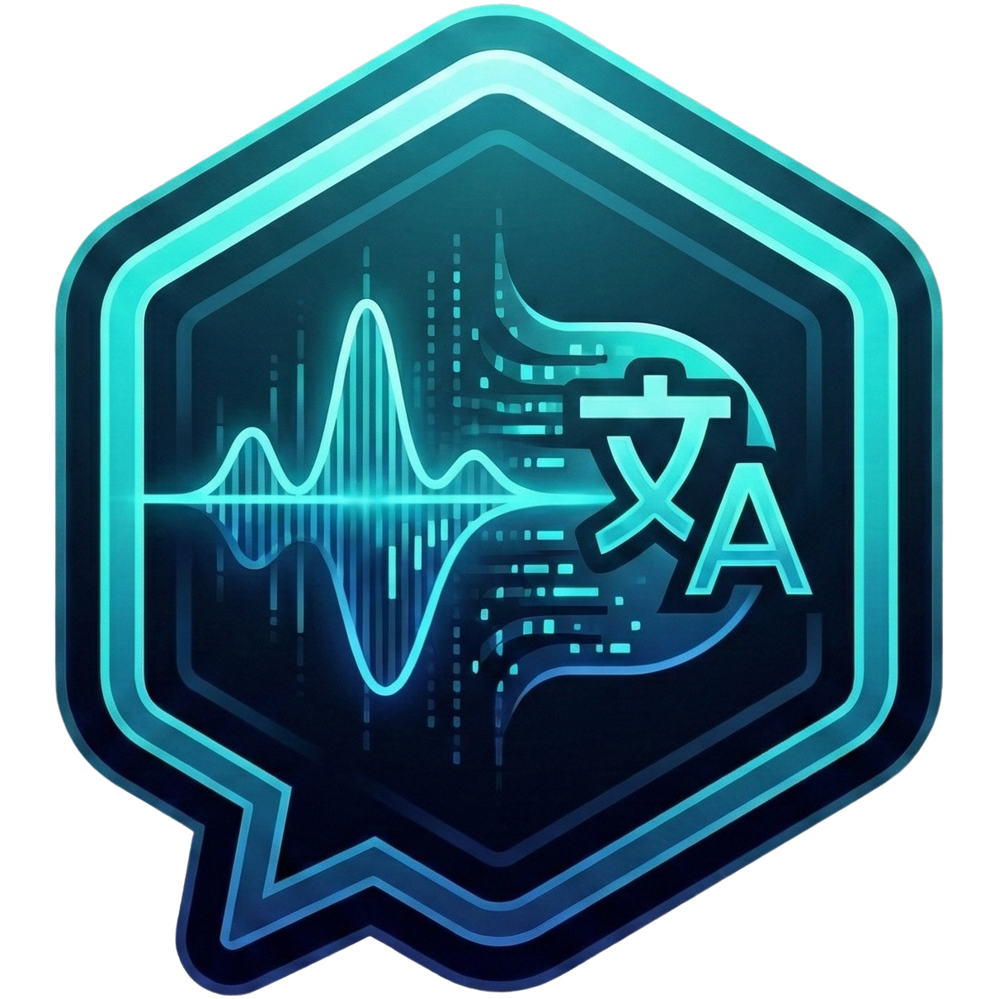
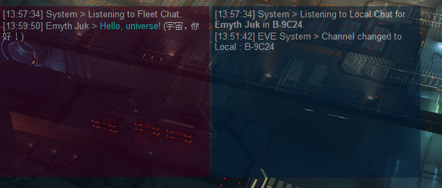
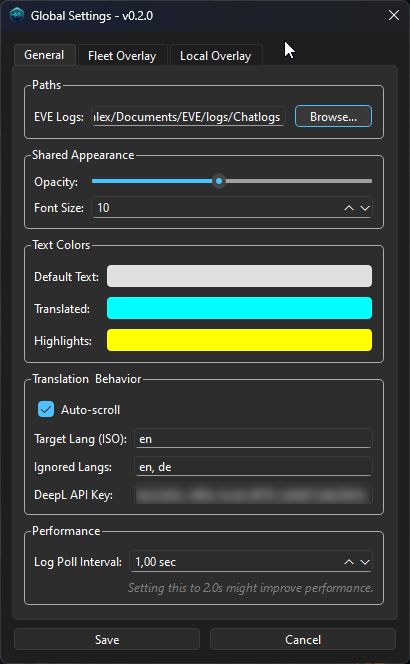
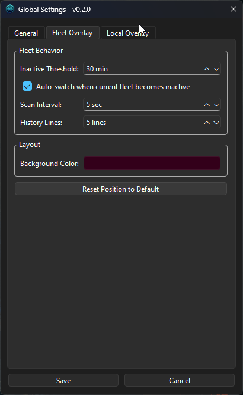
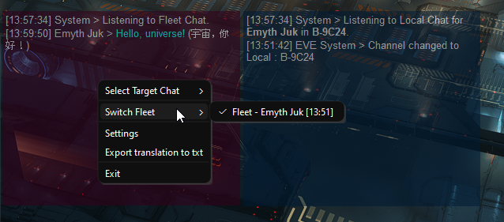

# EVE Translator

Real-time overlay translator for EVE Online fleet and local chat. Built for everyday EVE pilots; no technical setup required beyond your translation key.

## Screenshots
   

## What It Does
- Two overlays: one for Fleet, one for Local (toggle either on/off).
- Pre-translation glossary for EVE slang, ships, and common commands (less machine-translation noise).
- DeepL Free/Pro support; falls back to Google when no key is set.
- Auto-detects your active character log and updates Local automatically.
- Click-through friendly windows you can drag, resize, and right-click for quick actions.

## Requirements
- Windows PC running EVE Online.
- DeepL API key (Free or Pro) if you want the best quality. Google fallback works without a key.
- EVE client chat logging enabled (for Fleet/Local). In EVE: **Settings → Chat → Log Chat to File**.

### How to get a Free DeepL API Key
1. Go to [https://www.deepl.com/pro-api](https://www.deepl.com/pro-api).
2. Choose **DeepL API Free** (it’s separate from the Translator app).
3. Create an account or sign in.
4. Once subscribed, open your account dashboard → API plan → copy the **Authentication Key**. Free keys typically end with `:fx`.
5. In the app, paste that key into **Settings → API Key**.
6. Keep the key private; it’s tied to your account and monthly quota.

## Quick Start (Players)
1) Download: grab the latest `.exe` from the GitHub [Releases Page](https://github.com/emyth-juk/eve-translator/releases).  
2) Run: double-click `EVETranslator_vX.Y.exe`.  
3) Set your DeepL key: on first launch, enter it in Settings → API Key.  
4) Point to your chat logs if needed: Settings → Log Directory (default is usually auto-detected).  
5) Use it in game: position the overlays, adjust opacity/font size, and right-click for options (Settings, Export Logs, Toggle Sessions).

## First-Time Setup Details
- Config file location: `%USERPROFILE%\.eve_translator\translator_config.json` (auto-created).  
- Colors and UI: set default/translated/highlight colors in Settings; changes are live.  
- Glossaries: built-in slang/ship terms; user overrides go in `%USERPROFILE%\.eve_translator\glossaries\` (same keys as the bundled YAML files).  
- Logs: app logs live in `%USERPROFILE%\.eve_translator\logs\`.

## Using the Overlays
- Drag to move, resize from edges.  
- Right-click overlay: Settings, Export Logs, Toggle Fleet/Local sessions.  
- Local overlay will switch systems automatically when your character changes logs.  
- Text highlighting: glossary hits are highlighted; original text is viewable on translated messages.

## Troubleshooting
- No translations? Check your DeepL key and ensure EVE chat logging is on.  
- Wrong log path? Update it in Settings; the path typically ends with `Documents\EVE\logs\Chatlogs`.  
- Still seeing a default icon on Windows? Clear icon cache or rename the exe; the embedded icon is correct.  
- Logs for support: `%USERPROFILE%\.eve_translator\logs\translator.log`.

## For Developers (optional)
- Install: `pip install -r requirements.txt`  
- Run: `python -m src.main`  
- Tests: `pytest` (headless on Linux may need `xvfb-run pytest`)  
- Build (Windows): `build_exe.bat` produces `dist/EVETranslator_vX.Y.exe`.

## Changelog & Contributing
- Changes: see `CHANGELOG.md`.  
- Contributions: PRs welcome; open an issue to discuss feature ideas.  

Fly safe o7
